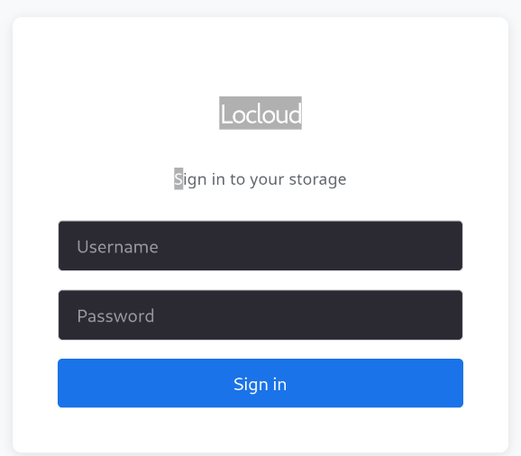

# Locloud
Local cloud service for light devices like a Raspberry Pi (Pi support planned but does not work as intended as of now)

Node.js reccomended



LoCloud allows you to upload, organize, and manage files through a  web interface running  locally on your device.

## Features:

Upload, download, and delete files

Folder-based organization

Storage usage tracking

## How to install
Download the tar file

cd into the download directory then:

cd Locloud

chmod +x run.sh

./run.sh

or 
```bash
git clone https://github.com/Melangert/Locloud.git
cd Locloud

chmod +x run.sh

./run.sh


```

## Notice
This project is still under development and will receive many future updates.


## Credits
Used AI for debugging and vite config.


